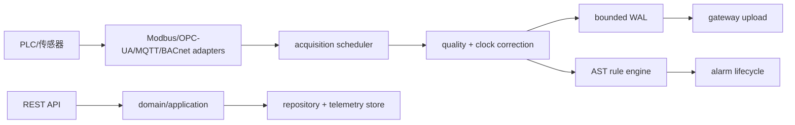

# Industrial Edge Protocol Platform

纯 Go 1.23 工业现场协议采集与边缘规则执行平台。核心链路覆盖设备建模、Modbus TCP 帧解析、MQTT topic 路由、采集调度、质量码传播、边缘规则、WAL 断网缓冲、命令安全、配置灰度和 telemetry 查询。

## 启动

```bash
go run ./cmd/edge-api
go run ./cmd/edge-worker
```

默认 API 地址为 `:8099`，可通过 `EDGE_HTTP_ADDR`、`EDGE_DATA_DIR`、`EDGE_MAX_BUFFER_BYTES`、`EDGE_WORKER_INTERVAL` 配置。服务提供 `/healthz`、`/readyz`、`/api/v1/sites`、`devices`、`gateways`、`points`、`acquisition-plans`、`rules`、`alarms`、`commands` 和 telemetry 查询。

## 架构



## 验证

```bash
gofmt -w $(find . -name '*.go')
go test ./...
go vet ./...
go test -race ./...
go build ./...
./scripts/smoke.sh
```

WAL 只保存采集摘要和质量信息，不上传宿主敏感数据。危险命令必须带互锁并经过审批，`dry_run` 可用于演练。尚未接入真实 PLC 时使用纯 Go mock reader/session，不会执行任意脚本。
